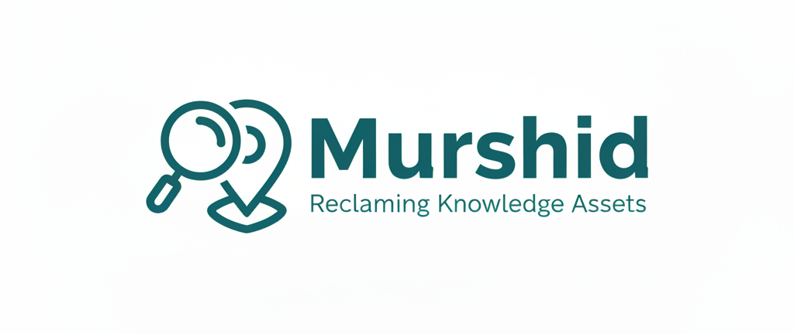
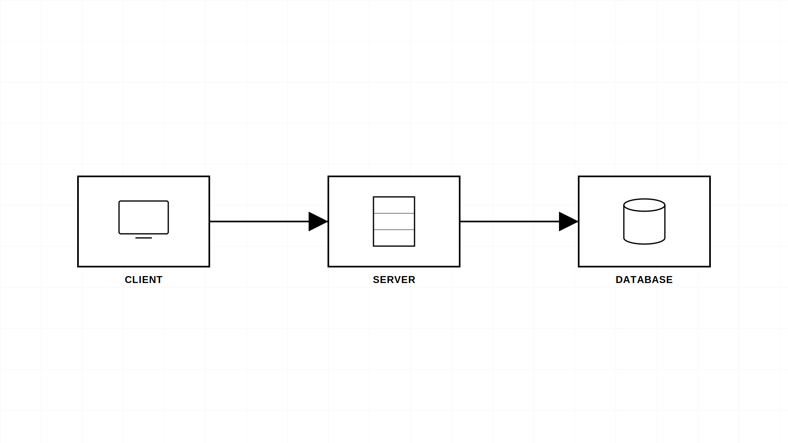
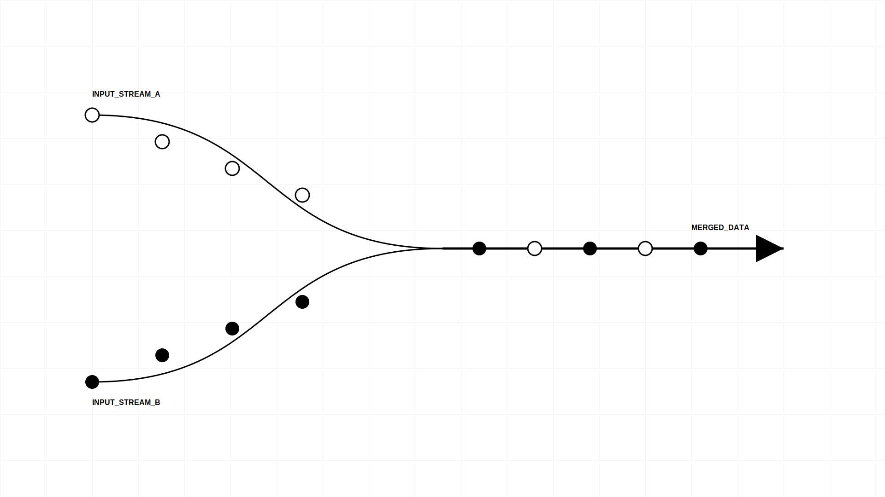

# مُرشد - نظام المفقودات الذكي (Murshid)



**مُرشد** هو منصة متطورة لإدارة المفقودات والموجودات تعتمد على الذكاء الاصطناعي لربط الأشخاص بأمتعتهم المفقودة بدقة وسرعة عالية. النظام يدمج تقنيات الرؤية الحاسوبية ومعالجة اللغات الطبيعية لتوفير تجربة مستخدم سلسة وآمنة.

## 🚀 المميزات الرئيسية

### 🤖 تحليل الصور بالذكاء الاصطناعي (Google Gemini)
بمجرد رفع صورة للغرض المفقود أو الموجود، يقوم النظام تلقائياً بـ:
- توليد وصف تفصيلي دقيق للجسم (النوع، اللون، الماركة، الحجم، المادة).
- استخراج السمات المميزة التي قد لا يلاحظها المستخدم العادي.
- تحويل الوصف لبيانات نصية تُستخدم في خوارزمية المطابقة.

### 🔍 خوارزمية المطابقة المتقدمة (Matching Engine)
يعتمد النظام على محرك مطابقة هجين يجمع بين 4 معايير:
1. **تشابه الوصف (AI Similarity):** مقارنة الأوصاف المولدة بالذكاء الاصطناعي بنسبة وزن 45%.
2. **البيانات النصية (Textual Data):** مقارنة العناوين والأوصاف اليدوية بنسبة 25%.
3. **الموقع الجغرافي (PWA GPS):** حساب المسافة بين مكان الفقد والعثور بنسبة 20%.
4. **العامل الزمني (Time Proximity):** مقارنة تواريخ الحدوث بنسبة 10%.



### 📱 تجربة مستخدم PWA
- **دعم التثبيت:** يمكن تثبيت التطبيق على الهواتف (iOS & Android) كأنه تطبيق أصلي.
- **إشعارات فورية:** تصلك تنبيهات عند وجود تطابق محتمل أو تحديث لحالة بلاغك.
- **تتبع حي للموقع:** استخدام الـ GPS لتحديد مكان الفقد/العثور بدقة على الخريطة.

---

## 🛠 البناء التقني (Tech Stack)

| الطبقة | التقنية المستخدمة |
| :--- | :--- |
| **Frontend** | React + Vite + Tailwind CSS |
| **Backend/DB** | Neon PostgreSQL (Serverless) |
| **AI Analysis** | Google Gemini 2.0 Flash (Multimodal) |
| **Image Hosting** | ImgBB API |
| **Icons** | Lucide React |
| **State Management** | React Context API + TanStack Query |

---

## 📐 بنية تدفق البيانات (Asset Flow)



1. **الرفع:** المستخدم يرفع صورة ومعلومات البلاغ.
2. **المعالجة:** يتم رفع الصورة لـ ImgBB، وبشكل متوازي يتم إرسالها لـ Gemini لتحليلها.
3. **التخزين:** تُحفظ الروابط والأوصاف في قاعدة بيانات Neon.
4. **التطابق:** يعمل محرك المطابقة في الخلفية ليبحث عن تقاطعات مع بلاغات حالية.
5. **الإشعار:** في حال وجود نسبة تطابق عالية، يتم إرسال إشعار للمديرين وللمستخدمين.

---

## 🔐 لوحة تحكم الإدارة (Admin Dashboard)

يوفر النظام لوحة تحكم شاملة للمديرين للقيام بـ:
- مراجعة كافة البلاغات (Lost & Found).
- مراجعة التطابقات الذكية وتأكيدها أو رفضها.
- إدارة المستخدمين وصلاحياتهم.
- متابعة الإحصائيات العامة للنظام.

---

## ⚙️ التثبيت والتشغيل المحلي

1. **نسخ المشروع:**
   ```bash
   git clone [repo-url]
   cd murshid-app
   ```

2. **تثبيت الملحقات:**
   ```bash
   npm install
   ```

3. **إعداد المتغيرات البيئية:**
   أنشئ ملف `.env` وقم بإضافة المفاتيح التالية:
   ```env
   VITE_DATABASE_URL="your-neon-db-url"
   VITE_IMGBB_API_KEY="your-imgbb-key"
   VITE_GEMINI_API_KEY="your-gemini-key"
   ```

4. **التشغيل:**
   ```bash
   npm run dev
   ```

---

## 🗺️ خارطة الطريق (Roadmap)
- [ ] دعم المكالمات الصوتية المشفرة داخل التطبيق.
- [ ] دمج خرائط Google Maps للتتبع الحي.
- [ ] دعم لغات إضافية (الفرنسية، الأوردو).
- [ ] استخدام التعلم العميق (Deep Learning) لتحسين الأوزان تلقائياً بناءً على تقييم المستخدمين.

---

**مُرشد - نساعدك لتجد ما فقدت.** 🌟
